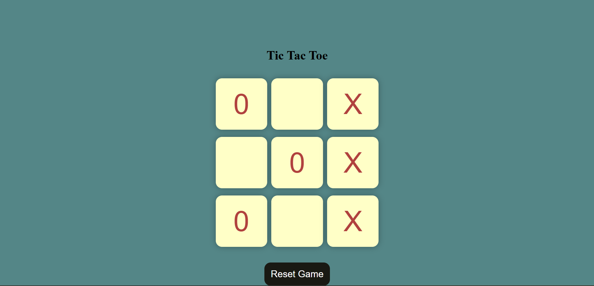
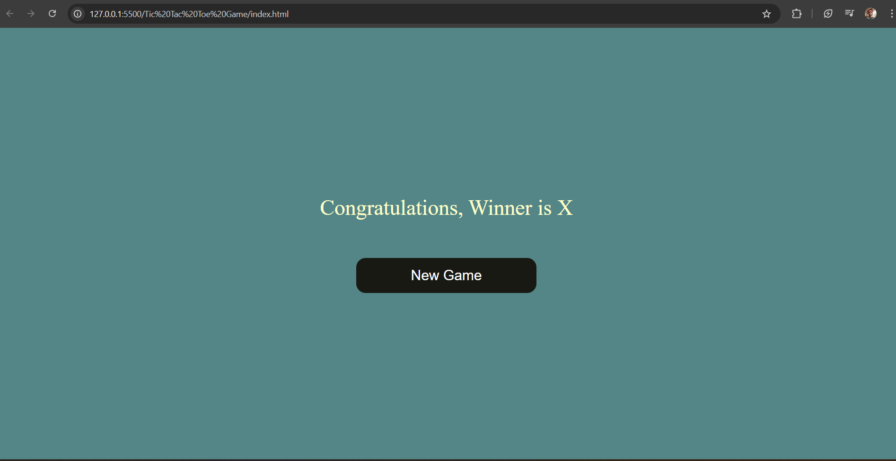

# Tic Tac Toe Game 🎮
A simple and interactive Tic Tac Toe game built using HTML, CSS and JavaScript.

---

## 🚀 Features
- Two player game (X and O)
- Winner detection
- Draw detection
- Restart game option
- Simple and clean UI

---

## 🛠️ Technologies Used
- HTML
- CSS
- JavaScript

---

## 🎯 How to Play
1. Open the game in a browser
2. Player X starts the game
3. Click on any empty cell to place your mark
4. First player to get 3 marks in a row wins
5. If all cells are filled and no winner, it's a draw

---

## 💻 Run Locally
1. Clone the repository
   ```bash
   git clone https://github.com/sonuyadav2004/Tic-Tac-Toe-game.git


## 📸 Screenshot


